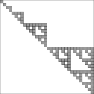
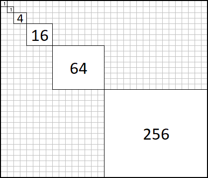
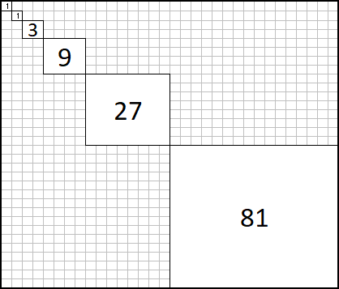

# Fast HEVC integer transform  

The largest transform size in HEVC is 32&times;32. The Standard defines the row-column method and one integer matrix to compute the residual block transform during decoding. With the naïve matrix-vector multiplication the 32-point 1-D IDCT transform would require 32&times;32 = 1024 multiplications. 

Based on the well-known recursive factorization of the DCT matrix from the literature we can reduce multiplications only for computing the odd sub-matrix parts. That requires 4+16+64+256 = 340 multiplications (66% reduction, figure left). 

I was further interested in computing these odd sub-matrix products with even less multiplications and derived an algoritm using transform of the odd DCT parts to signed-circular form and compute the products in a recursive way. The result is 3+9+27+81 = 120 integer multiplications for the 32-point 1-D transform of HEVC (88% reduction, figure right). 

 &nbsp;  

The method is based on C = P D P-1, where P is a signed-permutation matrix. 

There is also a draft paper I have written about it in this repo and based on the results C-code for all transform sizes. 

Here is an example during decoding the test stream **ipcm_A_NEC_3.bit** by my little HEVC decoder, the first transform is a 32&times;32 transform block. After decoding the residuals (coefficients) the result is the following (zeroes not shown): 

	Opening ipcm_A_NEC_3.bit
	
	cIdx: 0
	 9  0  0  1  0  1  1  0  0  0  0  0  0  0  0  0  0 .. .. 
	 1  1  0 -1  1  0  0  0  0  0  0  0  0  0  0  0  0
	 2  0  1  0  0 -1  0 -1  0  0  0  0  0  0 -1  0  0
	 0  0  0  0  0  0  0  0  0 -1  0  0  0  0  0  0  0
	 0  0  0 -1  0  0  0  0  0  0  0  0  0  0  0  0  0
	 0  0 -1  0 -1  0  0  0  0  1  0  0  0  0  0  0  0
	-1  0  0  0  0  0  0  0  0  0  0  0  0  0  0  0  0
	 1  0  0  0  0  0  0  0  0  0  0  0 -1  0  0  0  0
	 0  0  0  0  0  0 -1  0  0  0  0  0  0  0  0  0  0
	-1  0  0  0  0  0  0  0  0  0  0  0  0  0  0  0  0
	 0  0  0  0  0  1  0  0  0  0  0  0  0  0  0  0  0
	 0  0  0  0  0  0  0  0  0  0  0  0  0  0  0  0  0
	 0  0  0  0  0  0  0  0  0  0  0  0  0  0  0  0  0
	 0  0  0  0  0  0  0  0 -1  0  0  0  0  0  0  0  0
	 0  0  0  0  0  0  0  0  0  0  0  0  0  0  0  0  0
	 0  0  0  0  0  0  0  0  0  0  0  0  0  0  0  0  0
	 0  0  0  0  0  0  0  0  0  1  0  0  0  0  0  0  0
	 0  0  0  0  0  0  0  0  0  0  0  0  0  0  0  0  0
	 0  0  0  0  0  0  0  0  0  0  0  0  0  0  0  0 -1
	 ..
	 ..

The scaling is flat, 180 for all: 

	cIdx: 0
	1620    0    0  180    0  180  180    0    0    0    0    0    0    0    0    0    0   ..   ..
	 180  180    0 -180  180    0    0    0    0    0    0    0    0    0    0    0    0
	 360    0  180    0    0 -180    0 -180    0    0    0    0    0    0 -180    0    0
	   0    0    0    0    0    0    0    0    0 -180    0    0    0    0    0    0    0
	   0    0    0 -180    0    0    0    0    0    0    0    0    0    0    0    0    0
	   0    0 -180    0 -180    0    0    0    0  180    0    0    0    0    0    0    0
	-180    0    0    0    0    0    0    0    0    0    0    0    0    0    0    0    0
	 180    0    0    0    0    0    0    0    0    0    0    0 -180    0    0    0    0
	   0    0    0    0    0    0 -180    0    0    0    0    0    0    0    0    0    0
	-180    0    0    0    0    0    0    0    0    0    0    0    0    0    0    0    0
	   0    0    0    0    0  180    0    0    0    0    0    0    0    0    0    0    0
	   0    0    0    0    0    0    0    0    0    0    0    0    0    0    0    0    0
	   0    0    0    0    0    0    0    0    0    0    0    0    0    0    0    0    0
	   0    0    0    0    0    0    0    0 -180    0    0    0    0    0    0    0    0
	   0    0    0    0    0    0    0    0    0    0    0    0    0    0    0    0    0
	   0    0    0    0    0    0    0    0    0    0    0    0    0    0    0    0    0
	   0    0    0    0    0    0    0    0    0  180    0    0    0    0    0    0    0
	   0    0    0    0    0    0    0    0    0    0    0    0    0    0    0    0    0
	   0    0    0    0    0    0    0    0    0    0    0    0    0    0    0    0 -180
	   ..
	   ..

Then performing the inverse integer transform, we obtain the residuals added to the predicted values: 

	cIdx: 0
	   9   19   24   20   16   20   24   21   16   15   19   23   27   28   24   17  11    9   10   11   14   14   12   12   14   15   13   12   18   24   19    9
	  14   17   23   25   21   17   20   23   21   17   20   27   25   17   16   21  20   13   11   15   15   10   10   18   22   15    8    8   14   19   22   25
	  19   22   24   23   20   20   22   22   21   21   24   25   19   13   15   21  22   18   14   16   17   15   15   17   19   15    7    4   10   20   29   34
	  24   28   26   19   18   24   24   18   15   21   25   21   17   17   18   18  17   16   15   16   22   25   19   10    9   12   10    7   12   24   31   31
	  29   28   26   24   22   20   16   11   10   15   23   26   21   15   14   16  16   12   12   18   24   22   15    9    9   10   12   13   16   21   26   29
	  30   27   28   29   24   13    5    4    6   11   21   27   21   11    9   16  18   13   11   16   17   12    9   12   16   14   13   13   13   14   20   28
	  28   30   29   23   16   12    7    3    5   11   17   16   14   14   15   16  17   17   13    8    6    8   11   13   17   19   15    9    9   14   19   20
	  29   30   25   16   11   12   13   11    9    9    7    6   11   18   21   18  16   16   13    7    7   11   14   13   14   15   13   10   12   16   16   12
	  26   23   20   19   14   10   12   17   15    6    3    8   15   18   18   17  15   13   15   17   15   11   12   15   13    8    9   15   19   15   11   10
	  19   18   20   20   16   10    9   13   14   11   10   14   18   17   14   11  12   16   21   22   18   13   13   14   12    8    9   14   17   14    9    8
	  18   19   16   10    7    9   10    9   13   17   16   13   16   21   17    7   6   15   20   18   17   20   19   12    8    9   11   11   11   12    8    2
	  27   17    4   -3   -3    1    8   13   17   16   12   12   17   22   20   12   6    4    7   11   17   22   21   14    6    5    9   12   11    5    0   -2
	  30   11   -5   -8   -6   -5    2   12   17   14   11   14   17   18   18   15   7   -2   -2    6   14   17   17   15    7    3    8   14    9   -3   -7   -3
	  18    8   -3   -6   -4   -1   -1    1    9   17   18   15   14   16   14    8   4    4    3    3    7   13   14    8    4    7   13   12    3   -5   -7   -6
	   9    5    0   -2    2    5    1   -1    6   16   18   14   13   16   13    5   4    9   10    6    6   12   11    3    1    8   16   14    6   -1   -4   -6
	  14    5    0    3    7    6    5    9   14   13   11   12   15   16   14   12  10    9   11   12   11   10    9    7    4    5   13   20   15    4   -2    0
	  19   11    6    8    8    5    6   14   19   16   11   11   14   17   16   15  15   16   16   13    7    6   11   15   13   10   14   18   15    8    6    9
	  18   20   18   12    7    3    2    5   15   23   20   13   14   18   15    9  13   24   23   10   -1    3   13   19   20   21   18   11    8   10   13   14
	  20   21   21   16    7   -3   -8   -2   10   19   21   19   19   16   10    4   8   19   21   12    2    2   11   19   22   20   16   12    9    9   11   13
	  23   17   15   15    7   -7  -13   -4    6   10   14   19   20   12    4    2   3    7   13   14    9    5    9   16   16   11   11   15   13    5    4    9
	  18   15   12    8    2   -5  -10   -8    0    9   12   11    9    6    1   -2   1    7   11   10    7    8   11   12   10   10   10    8    4    2    4    6
	  10   11    9    4    2    0   -6   -9   -2   10   12    4   -3   -3   -3   -2   5   14   13    6    3    9   13   12   12   14   10   -1   -7   -3    4    9
	  11    6    4    7    8    4   -1   -1    3    6    7    4   -3   -7   -3    6  12   12   11   10   10   11   13   16   17   14   10    4   -4   -7    0    9
	  14    7    4    8   11    9    7    6    5    3    4    6    4    2    5   11  12    8    9   16   21   21   19   18   16   14   15   15    8   -1   -3    0
	  13   14   13   10   11   15   13    7    5    8   10   10   11   14   14    9   8   10   14   17   24   29   27   20   18   22   23   18   13    8    0   -7
	  14   18   18   15   12   12   12   10   10   13   15   15   15   16   13   10  10   13   17   19   23   28   29   29   29   28   23   16   12   10    5   -1
	  20   18   17   15   10    7   12   20   19   12   11   16   17   12   11   13  13   10   14   22   26   26   30   36   35   23   14   13   13   11    9    9
	  19   19   16    9    5    9   18   23   19   11    7    9   12   13   13   10   7    7   12   21   28   31   32   30   26   17    9    9   15   18   16   11
	  11   18   18   10    7   14   20   17   12   10    9    7    9   12   10    3   2    7   14   20   28   32   29   20   16   14    9    7   15   24   21   11
	   8   13   18   19   16   14   13   11    7    6   10   14   10    4    1    4   5    6   11   20   25   23   19   18   18   14   10   10   15   19   20   19
	  13   13   17   20   18   14   11    9    5    3    8   14   10    1    2   10  11    4    4   13   19   17   14   18   21   18   14   14   15   16   19   22
	  18   20   16   10   10   17   18   10    3    4    7    6    5    7   12   15  11    4   -1    3   13   20   18   15   18   22   20   14   14   19   21   18

The result was tested against another HEVC analyzer (Intel) and so far it is promising. 
